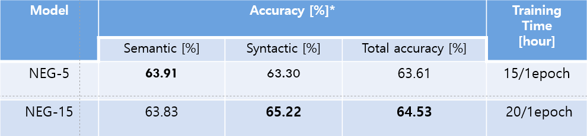
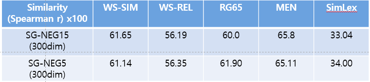

# Distributed Representations of Words and Phrases and their Compositionality

This code is implementation about Distributed Representations of Words and Phrases and their Compositionality paper, Word2Vec. [https://proceedings.neurips.cc/paper/2013/file/9aa42b31882ec039965f3c4923ce901b-Paper.pdf](https://proceedings.neurips.cc/paper/2013/file/9aa42b31882ec039965f3c4923ce901b-Paper.pdf)

## Task
To find word representations that are useful for predicting surrounding words in a sentence or a document. given a sequence of training words 

## Getting Started
Clone this repository.
```
git clone https://github.com/kosohae/NLP.git
```
## Download the Data
```
Download google one billion dataset.
Downloaded folder name would be **google_one_billion_monolingual_tokenized_shuffled**
and then put this folder in data directory.
```
## Preprocess data
- Modify config.py file as your path. set the hyperparameters 
- At first, run preprocess.py
```
python preprocess.py
```

- Results
1) vocabulary (vocb.pkl) : word
2) unigram distribution (unigram.pkl)
3) features for model (split n files .pkl)
preprocess context to neighbor set and negative set based on target word.

## Training the Model

```
python main.py
```

## Evaluation

- Analogy evaluation.


- Similarity


When training model, automatically evaluating similarity and analogy from evaluation path.

## Path for checkpoint

Trained embeddings skip-gram-neg-15 link.

[https://drive.google.com/drive/folders/1pWUIsIuQWVyzuXIlDNqYYG7ffLTOD1ow?usp=sharing](https://drive.google.com/drive/folders/1pWUIsIuQWVyzuXIlDNqYYG7ffLTOD1ow?usp=sharing)